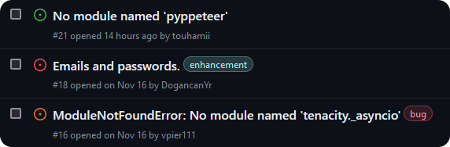

# GitHub Issue Helper

GH Issue Helper is a Firefox browser extension which allows you to mark issues with different levels of importance.

## Installation
[Download the latest release](https://github.com/qtchaos/gh-issue-helper/releases) and double-click the .xpi file and install it in the browser.

## Usage
Click on the small icon next to an issue to change the importance. The first click will mark the issue as red (ignored or blocked), the second click will mark the issues as orange (maybe or possible) and the third click will return the issue back to its green color (OK).

## Philosophy
The idea behind this extension is to make viewing GitHub issues easier, it allows you to ignore issues that either arent in the scope of the project or are a bit far-fetched. These sorts of issues become a problem if you arent a maintainer that can just close them.

## Development
This project uses Webpack to fuse all of the util scripts and the main script into one file. If you want to run the extension, use `pnpm start`. If you want to load this addon as a temporary addon in your browser, run `pnpm watch`, then visit [the debugging page](about:debugging#/runtime/this-firefox) and load the `content.bundle.js` as a temporary addon.